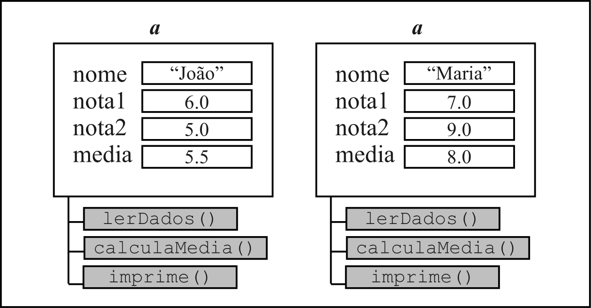

# Aula 7 - 14/04/2025

# Orientação a objetos

Esta aula descreve tópicos relevantes que apresentam a idéia inicial sobre o paradigma de programação orientada a objetos a partir da programação procedural e estruturada. A idéia é que o aluno entenda a orientação a objetos como uma nova forma de modelagem tomando como base conhecimentos já adquiridos nas aulas anteriores.

### Classes e Objetos para solução de problemas

Na programação orientada a objetos, os conceitos de classe, objeto, método, atributo e instância são fundamentais para o bom entendimento deste paradigma de programação. Entretanto, as definições sobre cada um desses conceitos talvez não seja a melhor maneira de compreendê-los. Desta forma, utilizamos um problema exemplo para apresentar esses conceitos. 

#### Problema
> Escreva um programa que realize a leitura de informações sobre um aluno: nome e duas notas. Seu programa deve calcular a média aritmética das notas, apresentar a média e as informações do aluno.

Uma implementação não orientada a objetos é apresentada conforme abaixo

~~~java
    String nome;
    double nota1, nota2, media;
    Scanner leitor = new Scanner(System.in);

    System.out.println("Digite nome do Aluno:");
    nome = leitor.nextLine();
    System.out.println("Digite nota 1:");
    nota1 = leitor.nextFloat();
    System.out.println("Digite nota 2:");
    nota2 = leitor.nextFloat();

    media = (nota1 + nota2) /2;

    System.out.println("Aluno: "+nome);
    System.out.println("Nota 1: "+nota1);
    System.out.println("Nota 2: "+nota2);
    System.out.println("Média: "+media);
    if(media >= 7) {
        System.out.println("APROVADO");
    } else {
        System.out.println("REPROVADO");
    }
~~~

Podemos notar que as variáveis representam informações e que existem 3 funcionalidades relacionadas à uma entidade Aluno. 

Na orientação a objetos chamamos a descrição dessas características e funcionalidades da entidade Aluno como **classe**.  

As características são chamadas de **atributos** e as funcionalidades de **métodos**.

Em Java, descrevemos a classe por meio da palavra reservada ```class```. Os atributos são descritos como variáveis declaradas dentro do bloco da classe, seguido dos métodos conforme apresentado abaixo.

~~~java
public class Aluno {
    String nome;
    double nota1, nota2, media;

    public void leitura() {
        Scanner leitor = new Scanner(System.in);
        System.out.println("Digite nome do Aluno:");
        nome = leitor.nextLine();
        System.out.println("Digite nota 1:");
        nota1 = leitor.nextFloat();
        System.out.println("Digite nota 2:");
        nota2 = leitor.nextFloat();
    }

    public void claculaMedia() {
        media = (nota1 + nota2) /2;
    }

    public void imprime() {
        System.out.println("Aluno: "+nome);
        System.out.println("Nota 1: "+nota1);
        System.out.println("Nota 2: "+nota2);
        System.out.println("Média: "+media);
        if(media >= 7) {
            System.out.println("APROVADO");
        } else {
            System.out.println("REPROVADO");
        }
    }
}
~~~

Neste caso, teríamos a classe ```Aluno``` descrevendo os atributos: ```nome```, ```nota1```, ```nota2``` e ```media``` e os métodos ```lerDados()```, ```calculaMedia()``` e ```imprime()```.

Note que a classe ```Aluno``` apenas descreve o comportamento de um aluno. 

Para que possamos armazenar informações nos atributos e realizar a execução dos métodos, precisamos que estas definições sejam concretizadas de alguma forma, ou seja, que uma estrutura computacional contendo as especificações descritas pela classe seja alocada em memória. 

Esta estrutura caracteriza o que chamamos de **objeto**. 

Para que possamos simular o comportamento de um objeto especificado pela classe ```Aluno```, construímos uma classe extra. 

O Java apenas permite a execução de classes que tenham definido um método específico, chamado ```main()```.

Com isso, abaixo descrevemos uma classe ```Prog``` que
possibilita a simulação do comportamento de um objeto instanciado da classe ```Aluno```. 

~~~java
public class Prog {
    public static void main(String args[]) {
        Aluno a1, a2;

        a1 = new Aluno();
        a2 = new Aluno();

        a1.lerDados();
        a1.calculaMedia();
        a1.imprime();

        a1.lerDados();
        a1.calculaMedia();
        a1.imprime();
    }
}
~~~

Declaramos duas variáveis ```a1``` e ```a2``` para armazenar objetos da classe ```Aluno```. Os objetos são instanciados e armazenados em ```a1``` e ```a2``` respectivamente por meio do comando ```new Aluno()```

Após isto, são realizadas as chamadas pelos métodos de cada um dos objetos. Note que, apesar dos objetos armazenados em ```a1``` e ```a2``` serem iguais nas características,  pois foram instanciados da mesma classe Aluno, ambos são independentes, podendo armazenar valores diferentes em seus atributos. 



A Figura apresenta uma possível representação dos objetos. 

## Algumas definições

A seguir, apresentamos algumas definições encontradas na literatura para os conceitos de classe, objeto, método e atributo. 

### Classe:

* Abstração do objeto;
* Descreve as características que definem um objeto: atributos e métodos;
* Molde para criação de objetos;
* Descrição dos objetos que a ela pertencem;
* Modelo de código utilizado para gerar objetos;
* Gabarito que define atributos e métodos de um objeto do mundo real. 

### Objeto:

* Instância da classe;
* Conjunto de atributos (características do objeto) e mensagens (ações que um objeto pode realizar) agrupados e armazenados em memória;
* Estrutura dinâmica originada com base em uma classe;
* Classe valorada. 

### Atributo

* Representam as informações do objeto e definem a estrutura do mesmo;
* Características;
* Informações;
* Estado. 

### Método:

* Ações ou serviços que um objeto pode realizar;
* Ação;
* Comportamento;
* Mensagem;
* Operação. 